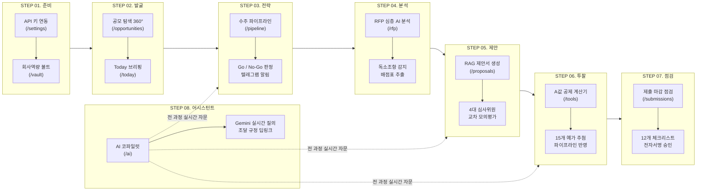

# 📘 RoboBid AI — 공식 종합 사용 설명서 및 수주 업무 매뉴얼

본 문서는 웹 애플리케이션 외부에서 편하게 인쇄하거나 별도로 열람할 수 있도록 정리된 **RoboBid AI의 전체 기능 구성도, 8대 수주 단계별 사용법 및 실무 팁**을 집대성한 독립 매뉴얼입니다.

---

## 🗺️ 1. 전체 수주 라이프사이클 8대 로드맵



---

## 🖥️ 2. 단계별 상세 기능 및 화면별 사용 방법

### [STEP 01] 초기 설정 & 사내 역량 등록 (`/settings`, `/vault`)

```
┌────────────────────────────────────────────────────────────────────────┐
│ [회사역량 볼트 (Capability Vault) 관리 화면]                           │
├────────────────────────────────────────────────────────────────────────┤
│ 사내 등록 자산 (총 4건)                   [신인도 가점 +5.0점 만점 충족] │
│ ────────────────────────────────────────────────────────────────────── │
│ ┌─────────────────────────────┐  ┌─────────────────────────────┐       │
│ │ [인증서] 이노비즈 (InnoBiz) │  │ [특허] 자율주행 로봇 제어   │       │
│ │ 기술혁신형 중소기업 확인서  │  │ SLAM 회피 알고리즘 특허     │       │
│ │ 유효기간: 2027-12-31        │  │ 특허청 등록 (제10-2024호)   │       │
│ │ 🟢 +1.5점 가점 확보         │  │ 🟢 +0.5점 가점 확보         │       │
│ └─────────────────────────────┘  └─────────────────────────────┘       │
└────────────────────────────────────────────────────────────────────────┘
```

* **핵심 목적**: 공공데이터 API 키를 연동하고, 사내 보유 특허·인증·실적을 등록하여 AI가 제안서와 적격심사에 활용할 수 있도록 기초 지식을 구축합니다.
* **기대 효과**: 조달청 및 정부 지원사업에서 요구하는 **신인도 가점(최대 +5.0점 만점)**을 사전 확보하고, 제안서 작성 시 사내 증빙을 100% 사실 기반(Zero Hallucination)으로 자동 인용합니다.
* **3단계 실행 방법**:
  1. **API 키 연동 확인 (`/settings`)**: [설정 & Admin]에서 Google Gemini 무료 API 키 및 공공데이터포털(조달청), 기업마당 인증키가 입력되어 있는지 확인합니다.
  2. **사내 역량 자산 등록 (`/vault`)**: [회사역량 볼트] 메뉴에서 `[+ 신규 역량 등록]` 버튼을 눌러 회사의 특허, 이노비즈 확인서, 여성기업 확인서, 주요 납품실적을 등록합니다.
  3. **만료일 관리**: 유효기간이 있는 인증서는 만료일을 입력해 두면 시스템이 30일/60일 전 갱신 필요 알림을 자동으로 전송합니다.
* **조달 실무 꿀팁**:
  - 조달청 물품·용역 적격심사는 중소기업확인서(+2.0), 이노비즈(+1.5), 특허(+0.5), 여성기업(+1.0) 등을 조합하면 손쉽게 상한선인 **+5.0점 만점**을 채울 수 있습니다.
  - 등록된 역량 자산은 제안서 본문에 `[근거: CAP-SEED-001]` 형태로 자동 인용됩니다.

---

### [STEP 02] 공모 탐색 & 실시간 공고 수집 (`/opportunities`, `/today`)

```
┌────────────────────────────────────────────────────────────────────────┐
│ [공모 탐색 360° 워크스페이스]             [1-Click 실시간 공고 동기화] │
├────────────────────────────────────────────────────────────────────────┤
│ ┌────────────────────────────────────────────────────────────────────┐ │
│ │ 🟢 AI 적합도 94점 (강력 추천)                       D-7일 마감     │ │
│ │ [부산항만공사] 스마트 항만 물류 자율이동로봇(AGV) 3단계 구축 사업    │ │
│ │ 🏛️ 발주기관: 부산항만공사        💰 배정예산: 850,000,000원          │ │
│ │ [수주 파이프라인 등록 (Bid Room 활성화)] ─────────────> 클릭 시 이관 │ │
│ └────────────────────────────────────────────────────────────────────┘ │
└────────────────────────────────────────────────────────────────────────┘
```

* **핵심 목적**: 조달청 나라장터 입찰 및 중기부 기업마당 지원사업 중에서 우리 회사 기술 역량과 가장 일치하는 고수익 사업을 실시간 탐색합니다.
* **기대 효과**: 단 한 번의 클릭으로 실시간 공고를 동기화하고, AI가 0~100점의 수주 적합도 점수(Fit Score)를 산출해 주므로 매일 수백 건의 공고를 일일이 읽을 필요가 없습니다.
* **3단계 실행 방법**:
  1. **실시간 공고 동기화 클릭 (`/opportunities`)**: 화면 상단의 `[실시간 공고 동기화]` 버튼을 누릅니다.
  2. **AI 적합도 점수 확인**: 공고 카드에 표시되는 AI 적합도 점수(예: 94점 초록색 뱃지)와 예산, 마감일을 확인합니다.
  3. **파이프라인 등록**: 참여 가치가 높은 공고의 `[수주 파이프라인 등록]` 버튼을 누릅니다.
* **조달 실무 꿀팁**:
  - 매일 출근 직후 `[오늘 & Action Center (/today)]` 메뉴에 접속하면 당일 마감 공고와 AI 요약 브리핑을 한눈에 확인할 수 있습니다.
  - 별도 입수한 비공개 공고나 민간 입찰은 `[수동 공고 등록]` 버튼으로 직접 등록 가능합니다.

---

### [STEP 03] 수주 파이프라인 & Go / No-Go 판정 (`/pipeline`)

```
┌────────────────────────────────────────────────────────────────────────┐
│ [수주 파이프라인 (Bid Room) 칸반 보드]                                  │
├────────────────────┬────────────────────┬──────────────────────────────┤
│ 1. 신규 발굴 (Inbox)│ 2. 추진 확정 (GO)  │ 3. 제안서 작성 (In Progress) │
├────────────────────┼────────────────────┼──────────────────────────────┤
│ 스마트 물류 AGV... │ 항만 자율주행 AGV  │ 제안서 초안 75% 완성         │
│ 예산: 8.5억원      │ ✓ GO 승인 완료     │ 4대 교차 검증 대기           │
│ [검토 진행]        │ [텔레그램 알림 전송│ [워크스페이스 열기]          │
└────────────────────┴────────────────────┴──────────────────────────────┘
```

* **핵심 목적**: 발굴된 공고의 사업성, 기술 난이도, 예상 마진을 검토하여 실제 입찰에 참여할지(GO), 포기할지(NO-GO) 전략적 결정을 내립니다.
* **기대 효과**: 불필요한 무리한 입찰 투입 리소스를 사전에 차단하고, 수주 확정(GO) 시 담당자들에게 텔레그램 알림 및 작업(Task)이 자동 분배됩니다.
* **3단계 실행 방법**:
  1. **공고 카드 선택 (`/pipeline`)**: 칸반 보드에서 검토 대상 공고 카드를 클릭합니다.
  2. **의사결정 팝업 작성**: `[의사결정 (Go/No-Go)]` 버튼을 누르고 수주 전략 및 조건부 승인 사항(예: 컨소시엄 구성)을 기재합니다.
  3. **GO 확정**: `[GO 확정]`을 누르면 제안서 작성 단계로 자동 이관됩니다.
* **조달 실무 꿀팁**:
  - GO 확정 즉시 사내 텔레그램 봇(`@robobid_mycompany_bot`)으로 공고명, 발주처, 예산, 마감일 정보가 실시간 알림으로 전송됩니다.

---

### [STEP 04] RFP 제안요청서 심층 AI 분석 (`/rfp`)

```
┌────────────────────────────────────────────────────────────────────────┐
│ [RFP AI Compliance Auditor 진단 결과]    [Google Gemini Flash 실시간]  │
├────────────────────────────────────────────────────────────────────────┤
│ ⚠️ 독소조항 및 입찰 리스크 감지 (2건)                                   │
│ • 지체상금 특약: 1일당 0.2% (국가계약예규 표준 0.125% 대비 1.6배 높음)  │
│ • 필수 참가자격: 정보통신공사업 면허 및 세부품명번호 10자리 직접생산확인│
│ ────────────────────────────────────────────────────────────────────── │
│ 📋 추출된 핵심 기술요구조건: 18건 (사내 특허/인증 매핑 100% 가능)       │
└────────────────────────────────────────────────────────────────────────┘
```

* **핵심 목적**: 수십~수백 페이지의 HWP, HWPX, PDF 제안요청서 파일을 AI로 파싱하여 핵심 과업, 기술 요구조건, 평가 배점표를 자동 추출합니다.
* **기대 효과**: 입찰 참가 자격 미달로 인한 **즉시 실격(Disqualification)** 위험과 과도한 지체상금·위약벌 등 독소조항을 10초 만에 완벽히 감지합니다.
* **3단계 실행 방법**:
  1. **RFP 파일 업로드 (`/rfp`)**: 화면의 업로드 영역에 공고문 및 과업지시서 파일을 끌어다 놓습니다.
  2. **AI 심층 분석 실행**: Google Gemini AI가 핵심 과업 요약, 배점표, 위험 조항을 실시간 분석합니다.
  3. **매트릭스 점검**: 필수 항목(Mandatory) 충족 여부와 사내 증빙 매핑을 점검합니다.
* **조달 실무 꿀팁**:
  - 직접생산확인증명서 세부품명번호 10자리가 공고문과 단 1자리라도 다르면 즉시 실격되므로 반드시 대조하세요.

---

### [STEP 05] AI 제안서 작성 & 4대 심사위원 모의평가 (`/proposals`)

```
┌────────────────────────────────────────────────────────────────────────┐
│ [제안서 워크스페이스 & 4대 심사위원 모의평가]                          │
├────────────────────────────────────────────────────────────────────────┤
│ 📄 2.1 시스템 아키텍처 (기술 부문)               [상태: AI_GENERATED]  │
│ ────────────────────────────────────────────────────────────────────── │
│ [4대 심사위원 모의평가 채점표]                                         │
│ ┌──────────────┬──────────────┬──────────────┬──────────────┐          │
│ │ 전략·사업성  │ 기술 아키텍처│ 행정 규정준수│ 예산·원가    │          │
│ │ 88점 (PASS)  │ 92점 (PASS)  │ 79점 (보완)  │ 85점 (PASS)  │          │
│ └──────────────┴──────────────┴──────────────┴──────────────┘          │
└────────────────────────────────────────────────────────────────────────┘
```

* **핵심 목적**: 조달청 및 R&D 7대 표준 목차의 제안서 초안을 사내 실적 증빙과 결합하여 80% 완성도로 자동 생성하고, 전문 평가위원 시각으로 사전 심사합니다.
* **기대 효과**: 밤샘 작성 없이 몇 분 만에 증빙 번호가 명시된 전문 제안서를 얻을 수 있으며, 전략·기술·행정·재무 4대 심사위원 교차평가로 평가위원 감점을 사전에 차단합니다.
* **3단계 실행 방법**:
  1. **초안 생성 클릭 (`/proposals`)**: 공고를 선택하고 `[RAG 기반 전체 초안 자동 생성]`을 클릭합니다.
  2. **본문 검토 및 편집**: 1.1 사업 배경부터 4.2 유지보수 계획까지 섹션별 내용을 검토하고 수치를 보완합니다.
  3. **교차검토 실행**: `[4대 심사위원 교차검토 실행]` 버튼을 눌러 점수(80점 이상 PASS)와 개선 권고사항을 확인합니다.
* **조달 실무 꿀팁**:
  - 제안서 본문 및 발표자료에 회사 로고나 대표자명을 표기하면 '블라인드 정성평가 위반'으로 1~3점 감점되므로 주의하세요.

---

### [STEP 06] 조달청 A값 투찰 계산기 & 파이프라인 연동 (`/tools`)

```
┌────────────────────────────────────────────────────────────────────────┐
│ [KONEPS A값 공제 투찰 시뮬레이터]                                      │
├────────────────────────────────────────────────────────────────────────┤
│ 최종 권장 투찰 금액 (A값 반영)                     [파이프라인에 적용] │
│ 752,999,600원                                    (공모 목표가 바인딩) │
│ (낙찰하한율 87.995% · 원단위 절상/CEIL 적용 완료)                      │
│ ────────────────────────────────────────────────────────────────────── │
│ 15개 복수예비가격 추첨 결과: [#1, #4, #8, #12 추첨됨]                  │
└────────────────────────────────────────────────────────────────────────┘
```

* **핵심 목적**: 국가계약법상 복수예비가격(15개 중 4개 추첨) 원리와 A값 공제 산식을 시뮬레이션하여 낙찰하한선 미달 탈락을 방지하고 최적 투찰가를 산출합니다.
* **A값 공제 공식**:
  $$\text{입찰가격} = (\text{예정가격} - A) \times \text{낙찰하한율} + A \quad (\text{원단위 올림/CEIL})$$
* **3단계 실행 방법**:
  1. **기초금액 및 A값 입력 (`/tools`)**: 공고문에 명시된 기초금액(예: 8.5억원)과 A값(국민연금, 건보료 등 고정비용, 예: 4,200만원)을 입력합니다.
  2. **예비가격 추첨 시뮬레이션**: `[예비가격 4개 랜덤 추첨]`을 눌러 사정율 골든존(99.3%~99.8%)의 최적 투찰가를 도출합니다.
  3. **파이프라인 적용**: `[파이프라인에 적용]` 버튼을 눌러 관리 중인 입찰 공고에 목표 투찰가(`estimatedPrice`)로 즉시 저장합니다.
* **조달 실무 꿀팁**:
  - 투찰금액 원단위 소수점 처리는 반드시 **절상(CEIL, 올림)**해야 합니다. 단 1원이라도 하한선 미달 시 적격심사 대상에서 영구 탈락합니다.

---

### [STEP 07] 제출 마감 점검 & 휴먼 인 더 루프 승인 (`/submissions`)

```
┌────────────────────────────────────────────────────────────────────────┐
│ [제출 마감 사전점검 & 서명 데스크]                                    │
├────────────────────────────────────────────────────────────────────────┤
│ 12개 점검 항목 통과율: 12 / 12 (100% 완료)                             │
│ • ✓ 나라장터 공인인증서 및 지문보안토큰 인증 통과                      │
│ • ✓ 투찰금액 한글/숫자 표기 정합성 일치 (752,999,600원)                │
│ • ✓ 직접생산확인증명서 세부품명번호 일치 확인                          │
│ ────────────────────────────────────────────────────────────────────── │
│ [담당자 전자서명]: 김수석 (사업개발팀)  ──> [최종 제출 완료 확정]     │
└────────────────────────────────────────────────────────────────────────┘
```

* **핵심 목적**: 마감 1~2시간 전, 전자서명 인증서, 보증서 납부, 투찰금액 일치 여부를 점검하고 담당자의 최종 서명으로 투찰 실수를 방지합니다.
* **기대 효과**: AI가 일방적으로 제출하지 않고, 담당자가 직접 점검하여 서명하는 '휴먼 인 더 루프(Human-in-the-loop)' 원칙으로 투찰 사고를 0%로 만듭니다.
* **3단계 실행 방법**:
  1. **체크리스트 확인 (`/submissions`)**: 12개 필수 항목을 순서대로 대조 확인합니다.
  2. **금액 최종 대사**: 계산기에서 연동된 금액과 나라장터 입력 금액의 한글/숫자 표기를 최종 확인합니다.
  3. **담당자 서명 확정**: 서명란에 이름을 기재하고 `[제출 완료 확정]` 버튼을 클릭합니다.
* **조달 실무 꿀팁**:
  - 마감 30분 전에는 나라장터 서버 접속 폭주로 시스템 지연이 발생하므로, 마감 최소 1시간 전 투찰을 완료하는 것이 원칙입니다.

---

### [STEP 08] 실시간 AI 코파일럿 활용법 (`/ai`)

```
┌────────────────────────────────────────────────────────────────────────┐
│ [RoboBid BidOps Copilot 대화창]            [Google Gemini Flash 가동]  │
├────────────────────────────────────────────────────────────────────────┤
│ 👤 사용자: "우리 회사 특허와 인증으로 적격심사 가점 만점 받을 수 있어?"│
│ ────────────────────────────────────────────────────────────────────── │
│ 🤖 Google Gemini Flash:                                                │
│ "현재 사내 Capability Vault에 등록된 중소기업확인서(+2.0),             │
│ 이노비즈(+1.5), 특허(+0.5), 여성기업(+1.0)으로 합산 +5.0점              │
│ (신인도 법정 상한선 만점) 획득이 확정적입니다!"                        │
│                                                                        │
│ [투찰가 시뮬레이터 열기 ➔]    [RFP 심층 분석기 실행 ➔]                 │
└────────────────────────────────────────────────────────────────────────┘
```

* **핵심 목적**: 국가계약법령, 조달청 적격심사 세부기준, 컨소시엄 지분율 규정을 실시간 LLM이 사내 실적과 대조하여 즉시 전문 답변을 제공합니다.
* **3단계 실행 방법**:
  1. **AI 코파일럿 접속 (`/ai`)**: 상단 헤더의 `Google Gemini Flash (실시간 가동)` 녹색 뱃지를 확인합니다.
  2. **자연어 질문 입력**: 적격심사 계산법, 실적 증빙 매핑, 사정율 전략 등을 자유롭게 질문합니다.
  3. **딥링크 액션 실행**: 답변 하단의 바로가기 버튼을 눌러 연관 도구로 즉시 이동합니다.

---

## 👥 3. 역할별 권장 실행 가이드

| 사용자 역할 | 주요 이용 메뉴 | 추천 실행 순서 |
| :--- | :--- | :--- |
| **대표이사 / 사업총괄** | `/today`, `/opportunities`, `/pipeline` | ① 오늘 마감 공고 브리핑 확인 ➔ ② 추천 공고 검토 ➔ ③ Go/No-Go 추진 승인 |
| **제안서 PM / 개발팀** | `/rfp`, `/proposals`, `/vault` | ① 제안요청서 업로드 및 독소조항 파악 ➔ ② 7대 목차 초안 생성 ➔ ③ 4대 심사위원 모의평가 |
| **경영지원 / 입찰행정** | `/tools`, `/submissions`, `/settings` | ① 사내 인증서 갱신일 관리 ➔ ② A값 투찰가 산출 및 공모 반영 ➔ ③ 12개 체크리스트 서명 제출 |
